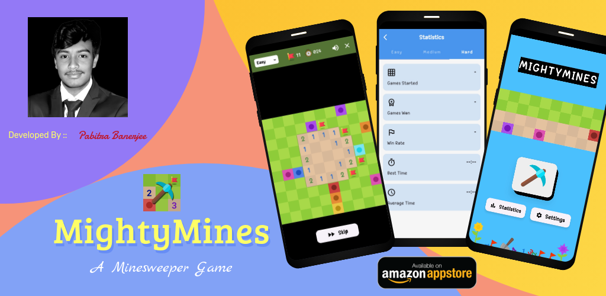
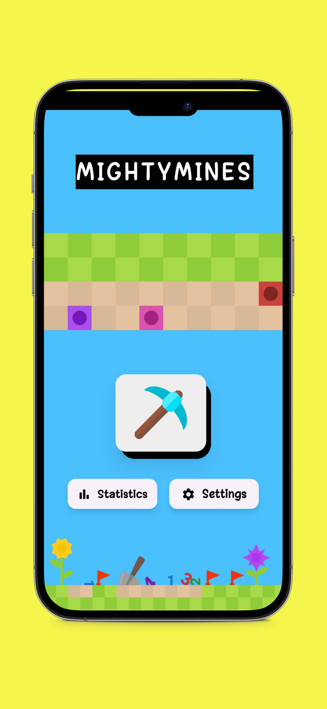
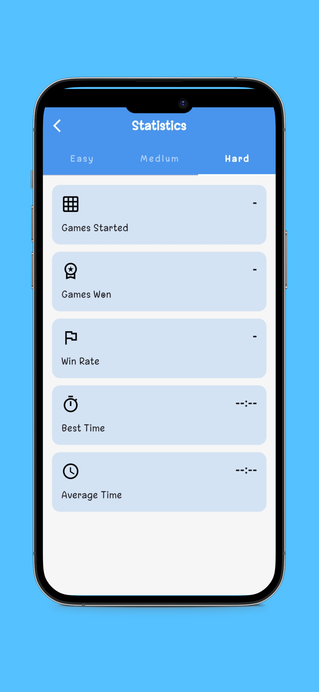
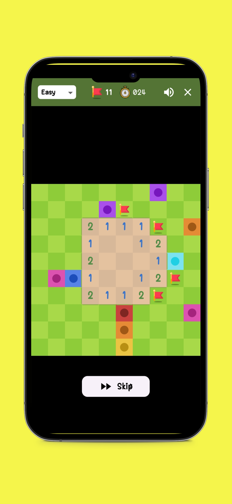
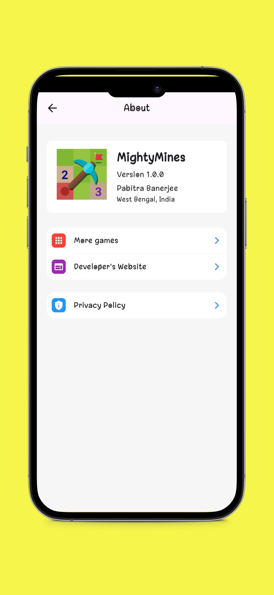

# MightyMines

Welcome to MightyMines, a dynamic and engaging Minesweeper game developed using Flutter and Dart technologies. MightyMines offers an exciting twist on the classic game, with a range of features designed to enhance your gaming experience. Whether you're a seasoned Minesweeper pro or a newcomer looking for a fun challenge, MightyMines has something for everyone.

## Features

- **Three Difficulty Settings**: Choose from Easy, Medium, and Hard difficulty levels to match your skill level. Each difficulty setting changes the size of the game board and the number of mines, providing a new challenge every time you play.
- **Sound Effects**: Enjoy immersive sound effects that enhance the gameplay experience.
- **Intuitive Controls**: Start a new game with the click of a button. Tap on any cell to reveal what's underneath, and hold down on a cell to place or remove a flag.
- **Flags for Marking Mines**: Use flags to mark cells that you suspect contain mines.
- **Timer**: A timer starts as soon as you begin a new game, adding an extra layer of challenge.
- **Statistics Page**: Keep track of your progress with a comprehensive statistics page.
- **Gameplay Metrics Tracking**: Detailed metrics are tracked for each game, allowing you to analyze your performance.

## Technologies Used

- **Flutter**
- **Dart**
- **Provider package for state management**
- **just_audio package for playing sounds**
- **shared_preferences package for saving high scores**
- **google_fonts package for font styles**

## Installation and Usage

Installing and playing MightyMines is a breeze. You can get the app from the Amazon AppStore and Indus AppStore. Alternatively, you can download it from the [GitHub repository](#) where the installation URL is provided. Once installed, start a new game by clicking the 'New Game' button. Choose your desired difficulty level and begin uncovering cells. Avoid the mines, use flags to mark potential dangers, and uncover the entire board to win the game.

## Screenshots

  
  
  
  

## Contributing

We welcome contributions to MightyMines! Please see our [CONTRIBUTING.md](CONTRIBUTING.md) for guidelines on how to contribute.

## Code of Conduct

Please note that this project is released with a [Code of Conduct](CODE_OF_CONDUCT.md). By participating in this project you agree to abide by its terms.

## Issues

If you find any bugs or have any feature requests, please open an issue in the [Issues section](https://github.com/PB2204/MightyMines/issues).

## Contact

For any questions or suggestions, feel free to reach out to the developer: [Pabitra Banerjee](https://github.com/PB2204)

LinkedIn: [Pabitra Banerjee](https://linkedin.com/in/pabitra-banerjee)
Email: [Pabitra Banerjee](mailto:rockstarpabitra2204@gmail.com)

## License

This project is licensed under the MIT License - see the [LICENSE](LICENSE) file for details.

---

Thank you for using MightyMines! Happy playing!
